# Alpha Architecture And Hierarchy

## Text Overview

The current application is a modular monolith split across a Next.js 14 App Router frontend and a FastAPI backend. The frontend carries much of the alpha experience through stateful demo-profile and demo-workflow layers, while the backend provides versioned APIs, domain routers, and supplier/payment adapter scaffolding.

### Frontend Layers

- Marketing and legal pages at the app root.
- Registration and invite acceptance entry points.
- Dashboard shell with tenant-aware branding, case jumping, and artifact routing.
- Module pages for leads, deals, finance, bookings, team, admin, content, comms, DMC, analytics, autopilot, EKLA, evolution, and itineraries.
- Shared client-side state for demo profile, demo workflow, demo events, demo scenarios, and screen help.
- Founder/demo artifacts including invoice, traveler PDF, audit report, and demo pack bundle.

### Backend Layers

- FastAPI application entrypoint with versioned routers under `backend/app/api/v1`.
- Domain API slices for auth, tenants, itineraries, bidding, bookings, communications, content, analytics, pricing, payments, sourcing, integrations, and demo.
- Agent and orchestration layer for analytics, itinerary support, and demo-centric operations.
- Adapter layer for supplier and service integrations such as TBO, Amadeus, Bokun, Stripe, and Razorpay readiness checks.
- Data layer with SQLAlchemy models, schemas, and database bindings.

### State Strategy In Alpha

- Frontend alpha continuity is primarily carried through browser-backed demo state.
- Backend has more complete domain boundaries than the frontend currently consumes.
- Several backend integrations are config-aware and mock/sandbox capable, but not fully wired into the live UI flow.

## Hierarchy Diagram

```mermaid
graph TD
    A["NAMA Alpha Application"] --> B["Frontend: Next.js 14 App Router"]
    A --> C["Backend: FastAPI Modular Monolith"]

    B --> B1["Public Pages"]
    B --> B2["Registration and Invite Entry"]
    B --> B3["Dashboard Shell"]
    B --> B4["Shared Demo State"]
    B --> B5["Founder Artifacts"]

    B1 --> B1a["Home"]
    B1 --> B1b["Contact / Privacy / Terms / Compliance"]
    B2 --> B2a["Register"]
    B2 --> B2b["Invite Acceptance"]
    B3 --> B3a["Overview"]
    B3 --> B3b["Leads / Deals / Finance / Bookings"]
    B3 --> B3c["Team / Admin / Artifacts"]
    B3 --> B3d["Content / Comms / DMC / Analytics"]
    B3 --> B3e["Autopilot / EKLA / Evolution / Itineraries"]
    B4 --> B4a["Demo Profile"]
    B4 --> B4b["Demo Workflow"]
    B4 --> B4c["Demo Events"]
    B4 --> B4d["Demo Scenarios"]
    B5 --> B5a["Invoice"]
    B5 --> B5b["Traveler PDF"]
    B5 --> B5c["Audit Report"]
    B5 --> B5d["Demo Pack"]

    C --> C1["API v1 Routers"]
    C --> C2["Agents"]
    C --> C3["Adapters"]
    C --> C4["Data Layer"]

    C1 --> C1a["Auth / Tenants / Demo"]
    C1 --> C1b["Bookings / Content / Communications"]
    C1 --> C1c["Pricing / Payments / Integrations"]
    C1 --> C1d["Analytics / Sourcing / Itineraries"]
    C2 --> C2a["Itinerary Agent"]
    C2 --> C2b["Analytics Agent"]
    C3 --> C3a["Amadeus"]
    C3 --> C3b["TBO"]
    C3 --> C3c["Bokun"]
    C3 --> C3d["Payments and Messaging Readiness"]
    C4 --> C4a["Models"]
    C4 --> C4b["Schemas"]
    C4 --> C4c["DB Session / Engine"]
```

## Current Architectural Reality

- The frontend is ahead of the backend in founder-demo completeness.
- The backend is ahead of the frontend in domain surface area.
- The shared demo-state layer is the bridge currently making the alpha feel coherent.
- Closing the gap between demo state and backend truth is the main architectural task for the next phase.

## Key Files

- Frontend shell: `src/app/layout.tsx`, `src/app/dashboard/layout.tsx`
- Frontend workflow state: `src/lib/demo-profile.ts`, `src/lib/demo-workflow.ts`, `src/lib/demo-events.ts`, `src/lib/demo-scenarios.ts`
- Backend entrypoint: `backend/app/main.py`
- Integration status: `backend/app/api/v1/integrations.py`
- Payments health: `backend/app/api/v1/payments.py`
- Supplier adapters: `backend/app/adapters/amadeus.py`, `backend/app/adapters/tbo.py`, `backend/app/adapters/bokun.py`
