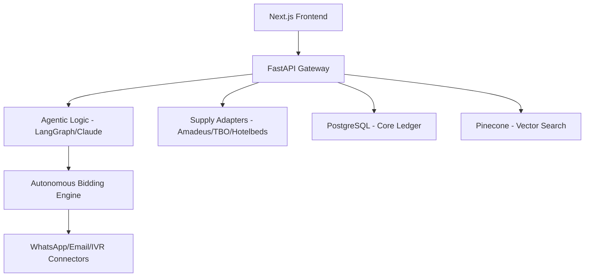

# NAMA System Architecture

## 1. High-Level Architecture
NAMA uses a **Modular Monolith** approach with micro-services for high-frequency operations (Bidding, Voice, Reconciliation).

## 2. Tech Stack Detail
*   **Frontend:** Next.js 14, Tailwind CSS, Shadcn UI, Framer Motion (Kinetic effects).
*   **Backend:** FastAPI (Python 3.11+), Pydantic v2.
*   **Orchestration:** LangChain/LangGraph for multi-agent workflows.
*   **Database:** 
    *   **Structured:** PostgreSQL (Prisma/SQLAlchemy) for transactional data.
    *   **Unstructured:** Pinecone for itinerary embeddings and semantic supply search.
*   **Infrastructure:** AWS/GCP (Multi-region for local data residency).

## 3. Data Model Strategy
*   **Tenancy:** Row-level security (RLS) in PostgreSQL for multi-tenant isolation.
*   **Concurrency:** Async/Await pattern in FastAPI to handle simultaneous API calls to external aggregators.
*   **Currency:** Atomic transactions using `decimal` type for financial precision.

## 4. AI-Autonomous Layer
The "Kinetic" layer uses a set of dedicated agents:
1.  **Planner Agent:** Decomposes queries into itinerary requirements.
2.  **Sourcing Agent:** Negotiates with vendors via automated bidding.
3.  **Financial Agent:** Validates contracts and performs real-time reconciliation.
