# NAMA Architecture Overview: Demo, Alpha, and MVP

## 1. System Summary

NAMA is currently a modular travel operating system built as a Next.js frontend plus a FastAPI backend. The current branch has a strong demo/alpha founder path with contract-backed auth, tenant activation, workflow continuity, and branded artifacts. The architecture should be understood in three layers: Demo, Alpha, and MVP.

## 1.1 Branch Truth

- Branch: `codex/beta-foundations`
- Verified head for this documentation pass: `900e0f6`
- Current stable emphasis: demo/alpha continuity, contract-backed sessions, and visible artifact handoff

## 2. Architectural Layers

### Demo Layer

The Demo layer proves the story:
- branded tenant registration
- invite activation
- lead-to-deal-to-finance-to-booking flow
- invoice and traveler artifact output
- separate Super Admin control path

The Demo layer may use seeded data and contract-backed local routes, but it must feel coherent and stable.

### Alpha Layer

The Alpha layer proves operational usability:
- signed session persistence
- route guards
- role-aware access
- visible workflow state
- smoke-tested admin and audit surfaces
- investor-safe shell and onboarding quality

### MVP Layer

The MVP layer must become durable:
- persistent backend entities
- authenticated writes
- real payment/subscription rails where required
- supplier integrations
- metrics and audit truth
- decision/outcome tracking
- migration-safe persistence and explicit APIs for every state transition that matters

## 3. High-Level Hierarchy

```mermaid
flowchart TD
    A["NAMA Travel OS"] --> B["Frontend: Next.js App Router"]
    A --> C["Backend: FastAPI Modular Monolith"]
    A --> D["Operational Data & Integrations"]

    B --> B1["Public + Marketing Pages"]
    B --> B2["Registration + Login"]
    B --> B3["Dashboard Shell"]
    B --> B4["Workflow Surfaces"]
    B --> B5["Artifacts + Admin"]

    B3 --> B31["Overview"]
    B3 --> B32["Leads"]
    B3 --> B33["Deals"]
    B3 --> B34["Finance"]
    B3 --> B35["Bookings"]
    B3 --> B36["Team"]
    B3 --> B37["Super Admin"]
    B3 --> B38["Analytics / Comms / DMC / Content"]
    B3 --> B39["Autopilot / EKLA / Evolution / Itineraries"]

    B4 --> B41["Demo workflow contract"]
    B4 --> B42["Session API"]
    B4 --> B43["Credential reset API"]
    B4 --> B44["Invite acceptance API"]

    B5 --> B51["Invoice Route"]
    B5 --> B52["Traveler PDF Route"]
    B5 --> B53["Audit Report"]
    B5 --> B54["Demo Pack"]

    C --> C1["Auth / Tenants / Sessions"]
    C --> C2["Founder workflow contracts"]
    C --> C3["Bookings / Finance / Payments"]
    C --> C4["Invites / Members / Credentials"]
    C --> C5["Audit / Admin / Support"]

    D --> D1["Seeded demo store"]
    D --> D2["Persistent DB layer"]
    D --> D3["Supplier adapters"]
    D --> D4["Payment rails"]
    D --> D5["Logging / smoke / audit"]
```

## 3.1 Source Of Truth Map

| Area | Current truth | Future MVP truth |
| --- | --- | --- |
| Sessions | Backend-issued session contracts mirrored into the app | DB-backed, revocable, persistent session records |
| Founder workflow | Seeded workflow contracts and same-origin demo routes | Durable records and authenticated writes |
| Demo UI continuity | Current branch screens with shared state propagation | Same surfaces, backed by persistent business truth |
| Admin/audit | Tenant/session audit routes and reports | Richer observability, retention, and reporting |
| Artifacts | Invoice and traveler PDF pages reflect workflow state | Artifact generation backed by durable records and events |

## 4. Runtime Flow

### 4.1 Entry And Session Flow

1. User opens `/register` or `/workspace/login` or `/super-admin/login`.
2. Frontend submits credentials to same-origin API routes or backend routes.
3. Session is issued and mirrored into the app session layer.
4. Route guards resolve the correct allowed workspace.
5. A missing or invalid session redirects the user to the correct login surface instead of leaving a dead end.

### 4.2 Founder Workflow Flow

1. Leads are loaded in the dashboard.
2. Lead stage changes are written through the workflow contract.
3. Deals page reads the same slug and resolves the case.
4. Finance actions update the workflow state.
5. Booking and artifact pages reflect downstream state.
6. Analytics and shell links should always keep the user inside the operating flow.

### 4.3 Admin And Audit Flow

1. Super Admin signs in through the dedicated route.
2. Backend-backed current session is validated.
3. Admin dashboard reads auth audit and tenant lifecycle data.
4. Revoke/logout clears the session and returns the user to login.

## 5. Current State By Branch Area

### Stable

- tenant and super-admin session flows
- invite acceptance and credential lifecycle
- founder workflow contract paths
- dashboard shell and onboarding shell
- route audit and smoke harnesses

### Improved But Still Evolving

- deals / finance / booking presentation
- invoice and traveler artifact handoff states
- admin and audit report depth
- demo and tenant role smoke assertions
- analytics continuity back into the working flow
- docs package now provides a more honest handoff story for Demo, Alpha, and MVP

### MVP-Focused Next Work

- persistent records for workflow objects
- deeper supplier/payment truth
- metrics, reporting, and decision history
- stronger developer-facing API and schema docs
- a formal event model for decision traces and outcome learning
- explicit module owners and API contracts for future contributors

## 6. Key Files

- Frontend shell: `src/app/dashboard/layout.tsx`
- Frontend onboarding: `src/app/register/page.tsx`
- Founders and demo workflow: `src/lib/demo-workflow.ts`
- Sessions: `src/lib/session-api.ts`, `src/lib/auth-session.ts`
- Contracts: `src/app/api/v1/demo/workflow/route.ts`, `src/app/api/v1/demo/case/[slug]/route.ts`
- Backend auth and workflow: `backend/app/api/v1/*.py`
- Smoke and audit: `scripts/founder_flow_smoke.mjs`, `scripts/tenant_role_smoke.mjs`, `scripts/super_admin_smoke.mjs`, `scripts/route_audit_smoke.mjs`

## 7. Demo / Alpha / MVP Split

### Demo

The Demo layer is UI-coherent and flow-complete for practice and rehearsal.

### Alpha

The Alpha layer is stable enough for guided review, investor walkthroughs, and operational testing.

### MVP

The MVP layer should replace seeded/preview mechanics with durable records, production-grade integration rules, and richer observability.

## 7.1 Practical Interpretation

- Demo is for rehearsal and storytelling.
- Alpha is for operational confidence and repeatability.
- MVP is for durability, persistence, and integration truth.
- If a screen says "preview" or "sandbox," that wording should be preserved until the underlying truth is upgraded.

## 7.2 Release Readiness Summary

- Demo is user-facing and rehearsal-ready on the core founder path.
- Alpha is operationally stable on the current branch, with the remaining work concentrated in long-tail modules and language cleanup.
- MVP is still a productization phase, not a hidden continuation of the seeded demo store.

## 8. Architecture Risks

- Demo routes can look more final than the backend truth underneath them.
- Long-tail modules may still be narrative-heavy rather than fully operational.
- Production deployment should continue to use build and smoke gates.
- Any new data model should stay migration-safe and explicitly documented.
- The most dangerous failure is a screen that looks complete but is not backed by a stable contract or persisted state.
