# Demo, Alpha, And MVP Architecture

## Overview

NAMA currently operates as a modular monolith with a Next.js App Router frontend and a FastAPI backend. The same product is expressed in three maturity layers: Demo, Alpha, and MVP.

## Hierarchy

```mermaid
graph TD
    A["NAMA Travel OS"] --> B["Demo Layer"]
    A --> C["Alpha Layer"]
    A --> D["MVP Layer"]

    B --> B1["Presentation-safe shell"]
    B --> B2["Seeded workflow continuity"]
    B --> B3["Branded artifact routes"]
    B --> B4["Super Admin walkthrough"]

    C --> C1["Credential-backed access"]
    C --> C2["Signed session validation"]
    C --> C3["API-first workflow actions"]
    C --> C4["Seeded founder contracts"]
    C --> C5["Smoke-tested multi-role paths"]

    D --> D1["Durable backend source of truth"]
    D --> D2["Authenticated contract writes"]
    D --> D3["Truthful sandbox payments and sourcing"]
    D --> D4["Operational analytics"]
    D --> D5["Developer-ready deployment posture"]

    A --> E["Frontend"]
    A --> F["Backend"]
    A --> G["Shared State / Contracts"]

    E --> E1["Public entry routes"]
    E --> E2["Dashboard shell"]
    E --> E3["Core modules"]
    E --> E4["Artifact and audit routes"]

    F --> F1["Auth and tenant contracts"]
    F --> F2["Founder workflow contracts"]
    F --> F3["Domain APIs"]
    F --> F4["Adapter / readiness layer"]

    G --> G1["Demo workflow state"]
    G --> G2["Session contracts"]
    G --> G3["Tenant member / invite contracts"]
```

## Demo Architecture

Demo relies on seeded state, strong route continuity, and a coherent shell. The objective is not full operational truth. The objective is a credible walkthrough with consistent branding, roles, and case progression.

## Alpha Architecture

Alpha adds stronger access control, cookie-backed session validation, API-first workflow actions, and seeded backend contract state for the founder path. The frontend still carries some preview state, but the core access and continuity story is much stronger than the original alpha build.

## MVP Architecture

MVP should reduce the use of browser-local continuity for core commercial actions and shift the main source of truth to authenticated backend contracts. This includes CRM/deals, finance/bookings, communications, and supplier interactions.

## Current Strong Areas

- Tenant and platform auth/session contracts
- Invite and member lifecycle
- Founder-path action continuity
- Artifact and audit/report surfaces
- Stitch-style dashboard and onboarding shell

## Current Weak Areas

- CRM durability
- Comms provider flow
- Supplier / DMC operations depth
- Operational analytics truth
- Narrative-heavy modules such as Autopilot, EKLA, and Evolution

## Recommended MVP Layering

1. Core identity and governance
2. Core commercial flow
3. Customer-facing artifact flow
4. External rails and analytics
5. Decision intelligence layer after MVP
