# NAMA Architecture Map

```mermaid
flowchart TD
  subgraph Public["Public Surface"]
    Home["/"]
    Pricing["/pricing"]
    Login["/login"]
    Register["/register"]
    Forgot["/forgot-password"]
    Onboarding["/onboarding"]
    Demo["/demo"]
    Portal["/portal/[bookingId]"]
    Proposal["/proposal/[id]"]
  end

  subgraph Growth["Growth + Entry"]
    Widget["/dashboard/widget"]
    Capture["/api/v1/capture/*"]
    Queries["/dashboard/queries"]
    Leads["/dashboard/leads"]
  end

  subgraph Core["Core CRM + Ops"]
    Itins["/dashboard/itineraries"]
    Quotes["/dashboard/quotations"]
    Bookings["/dashboard/bookings"]
    Docs["/dashboard/documents"]
    Finance["/dashboard/finance"]
    Comms["/dashboard/comms"]
    Vendors["/dashboard/vendors"]
    Clients["/dashboard/clients"]
    Calendar["/dashboard/calendar"]
    Content["/dashboard/content"]
  end

  subgraph Intelligence["Intelligence + Automation"]
    Intel["/dashboard/intel"]
    Reports["/dashboard/reports"]
    Routines["/dashboard/routines"]
    Automations["/dashboard/automations"]
    Sentinel["/dashboard/sentinel"]
    Integrations["/dashboard/integrations"]
    Roles["/dashboard/roles"]
    Org["/dashboard/org"]
    Status["/dashboard/status"]
    KB["/dashboard/kb"]
  end

  subgraph Specialized["Specialized / Partial"]
    Visas["/dashboard/visas"]
    Contracts["/dashboard/contracts"]
    Intentra["/dashboard/intentra"]
    Investor["/dashboard/investor"]
    Owner["/owner/*"]
    SuperAdmin["/super-admin"]
  end

  subgraph Dynamix["Dynamix Route Group"]
    Dyn1["/dynamix"]
    DynResults["/dynamix/results"]
    DynBuilder["/dynamix/builder"]
    DynSend["/dynamix/send"]
    DynApproval["/dynamix/approval"]
    DynWeather["/api/dynamix/weather"]
    DynMissing["/api/dynamix/missing-destination"]
  end

  subgraph Backend["Railway / Backend APIs"]
    Health["/api/v1/health"]
    QueriesApi["/api/v1/queries/*"]
    QuotesApi["/api/v1/quotations/*"]
    BookingsApi["/api/v1/bookings/*"]
    DocsApi["/api/v1/documents/*"]
    FinanceApi["/api/v1/finance/*"]
    VendorsApi["/api/v1/vendors/*"]
    WhatsappApi["/api/v1/whatsapp/*"]
  end

  Home --> Queries
  Home --> Demo
  Register --> Onboarding
  Onboarding --> Leads
  Demo --> Leads
  Widget --> Capture
  Capture --> Leads
  Queries --> Leads
  Leads --> Itins
  Itins --> Quotes
  Quotes --> Bookings
  Quotes --> Docs
  Quotes --> Finance
  Bookings --> Docs
  Bookings --> Finance
  Bookings --> Portal
  Comms --> Leads
  Comms --> Quotes
  Calendar --> Comms
  Vendors --> Itins
  Clients --> Quotes
  Content --> Itins
  Reports --> Finance
  Routines --> Comms
  Routines --> Docs
  Automations --> Leads
  Automations --> Comms
  Owner --> Portal
  SuperAdmin --> Org

  Dyn1 --> DynResults
  Dyn1 --> DynBuilder
  DynBuilder --> DynSend
  DynSend --> Quotes
  DynBuilder --> Bookings
  DynBuilder --> Comms
  DynApproval --> Quotes
  DynApproval --> Bookings
  Dyn1 --> DynWeather
  Dyn1 --> DynMissing

  Queries --> QueriesApi
  Quotes --> QuotesApi
  Bookings --> BookingsApi
  Docs --> DocsApi
  Finance --> FinanceApi
  Vendors --> VendorsApi
  Comms --> WhatsappApi
  Status --> Health
  KB --> Health

  DynSend -. "localStorage handoff\npartial bridge" .-> Quotes
  DynApproval -. "not yet automatic:\naccepted quote -> booking" .-> Bookings
  DynApproval -. "missing automatic chain:\nbooking -> docs/vouchers/invoices" .-> Docs
  DynApproval -. "missing automatic chain:\ndocs/payments -> finance lifecycle" .-> Finance

  Intentra:::pending
  Contracts:::pending
  Visas:::pending
  Owner:::partial
  SuperAdmin:::partial
  DynApproval:::partial

  classDef pending fill:#5a0b0b,stroke:#ff4d4f,color:#fff,stroke-width:2px;
  classDef partial fill:#3d1f09,stroke:#ff944d,color:#fff,stroke-width:2px;
```

## Legend

- Dark red node: pending / still materially incomplete
- Orange-brown node: partial / connected but not fully closed-loop
- Red dotted line: missing or incomplete flow
- Solid line: present route or handoff path
